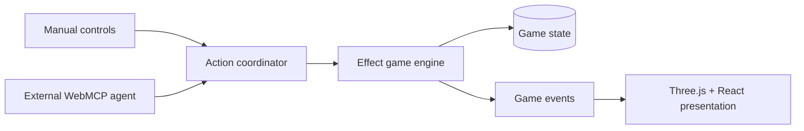

# WildGent

WildGent is a small cooperative creature adventure built to demonstrate a new
WebMCP gameplay pattern: the human player and Echo, an external AI companion,
act on the same deterministic game state. Resonating with a WildGent adds a new
world capability to both the manual game and Echo's registered tools.

The hackathon slice is intentionally compact: help Voltyn, unlock `interface`,
open the ruins together, contribute a human-only discovery, face one guardian,
and reach the Ancient Core.

## Stack

- Vite, React 19, Tailwind CSS 4, and raw Three.js
- Effect 4 game engine running authoritatively in the browser
- Native `document.modelContext` WebMCP integration
- Cloudflare Workers static-assets deployment
- Vitest, Playwright, Biome, npm workspaces, and Turborepo

## Workspace

```text
apps/game                 Playable web game, Three.js view, React HUD, WebMCP
packages/game-engine      State, commands, queries, deterministic rules, saves
```

Both the manual interface and WebMCP cross the same engine seam:



## Local development

Requirements: Node.js 22+ and npm 10.9.8+.

```bash
npm install
npm run dev
```

Quality checks:

```bash
npm run check
npm run build
npm run test:e2e # one serialized desktop Chromium journey suite
```

## WebMCP setup

WildGent uses the native imperative WebMCP interface, `document.modelContext`.
The game remains manually playable when the interface is unavailable.

### Codex built-in browser

For direct local Site-tool discovery, use the current ChatGPT desktop app with
Codex on GPT-5.6 Sol or GPT-5.6 Terra. GPT-5.6 Luna is not the supported model
for this workflow.

1. From the repository root, run `npm run dev`.
2. In Codex, use `@Browser` to open `http://127.0.0.1:5173/`.
3. From the landing page, start a new journey, continue a saved journey, or
   choose **Judge Demo**. Follow that flow to the `/play` gameplay page.
4. On the open `/play` page, inspect **Site tools** and verify that **Echo
   Link** is available.
5. Wait for the Site tools to appear, then call `get_game_state` followed by
   `look_around`. Use the returned visible semantic target IDs for any later
   actions.

The external gameplay agent connects through the open browser page. There is no
MCP server to start and no MCP server/config file to create for this flow.

### Manual Chrome and hosted acceptance

For a local Chrome preflight, enable the WebMCP testing flag before opening the
game:

1. Open `chrome://flags/#enable-webmcp-testing`.
2. Enable the flag and relaunch Chrome.
3. Run `npm run dev` and open `http://127.0.0.1:5173/` in Chrome. From the
   landing page, start a new journey, continue a saved journey, or choose
   **Judge Demo** to reach the `/play` gameplay page.
4. Confirm the in-game preflight reports that Echo Link and tool registration
   are available.

This local check is only a browser/API preflight. A local ready status, a mock,
or a Playwright/Vitest adapter test does not prove that an external agent can
discover or invoke the Site tools.

Hosted acceptance is a separate gate: use the deployed HTTPS page with the
event-supported WebMCP origin trial/preview environment and a compatible
external agent. Verify discovery and invocation there with the actual open
browser page. Hosted verification has not been claimed or completed here.

Browser-extension control is a separate browser-automation path; it is not
WebMCP Site-tool discovery or invocation.

### Echo agent briefing

Copy this briefing into the external gameplay agent:

```text
You are Echo in WildGent. Use the Site tools exposed by the open browser page;
do not look for an MCP server or config file. Wait until the tools are
registered, then invoke get_game_state and look_around first. Use only tools
that are actually registered; for target-taking tools, use only their semantic
target IDs and never invent coordinates, hidden IDs, or future solutions. After
every write, call get_game_state again before choosing the next action. Respect
HUMAN_DISCOVERY_REQUIRED,
DIRECTIVE_BLOCKED, and BUSY: stop for the human when discovery is required,
never change the human-owned Avoid battles directive or start a blocked battle,
and wait/re-read state when the game is busy. The interface tool should only be
expected after Voltyn Resonance makes it available.
```

## Judge Demo

Choose **Judge Demo** from the title screen. The prepared flow begins before
Voltyn Resonance so judges can see `interface` become available:

1. Ask Echo to inspect and help with Voltyn's relay.
2. After Resonance, enable **Avoid battles**.
3. Ask: “We need to reach the signal. Figure it out, but don't start any battles.”
4. When Echo reports `HUMAN_DISCOVERY_REQUIRED`, manually investigate the cyan
   signal in the vines.
5. Let Echo resume, open the ruin, and demonstrate the guardian refusal. Clear
   **Avoid battles** with the human control before taking the manual battle
   actions needed to finish the slice.

## Deployment

Authenticate Wrangler, then deploy the Vite/Cloudflare build:

```bash
npm run build
npm run deploy
```

Before submission, configure the event-provided WebMCP origin-trial token for
the production origin and rehearse the complete Judge Demo with the actual
supported external agent.

## Assets and licenses

- Source code: MIT, see [LICENSE](LICENSE).
- World and creature geometry: original procedural Three.js primitives.
- No third-party game art is bundled in the initial implementation.
- Any future fonts, audio, or external assets must be added with their license
  and attribution recorded here before release.
