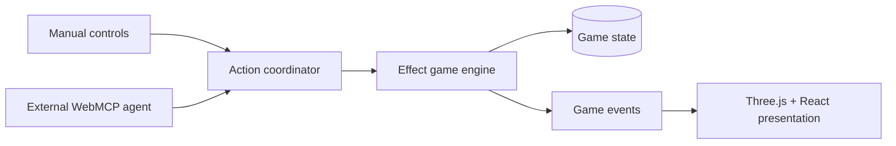

# WildGent

WildGent is a small cooperative creature adventure built to demonstrate a new
WebMCP gameplay pattern: the human player and Echo, an external AI companion,
act on the same deterministic game state. Resonating with a WildGent adds a new
world capability to both the manual game and Echo's registered tools.

The hackathon slice is intentionally compact: help Voltyn, unlock `interface`,
open the ruins together, contribute a human-only discovery, face one guardian,
and reach the Ancient Core.

## Stack

- Vite, React 19, Tailwind CSS 4, and raw Three.js
- Effect 4 game engine running authoritatively in the browser
- Native `document.modelContext` WebMCP integration
- Cloudflare Workers static-assets deployment
- Vitest, Playwright, Biome, npm workspaces, and Turborepo

## Workspace

```text
apps/game                 Playable web game, Three.js view, React HUD, WebMCP
packages/game-engine      State, commands, queries, deterministic rules, saves
```

Both the manual interface and WebMCP cross the same engine seam:



## Local development

Requirements: Node.js 22+ and npm 10.9.8+.

```bash
npm install
npm run dev
```

Quality checks:

```bash
npm run check
npm run build
npm run test:e2e
```

## WebMCP setup

WildGent uses the native imperative WebMCP interface, `document.modelContext`.
The game remains manually playable when the interface is unavailable.

Local Chrome testing currently requires the WebMCP testing flag:

1. Open `chrome://flags/#enable-webmcp-testing`.
2. Enable the flag and relaunch Chrome.
3. Open the local WildGent origin using the supported WebMCP-capable agent.
4. Confirm the in-game preflight reports that tool registration is available.

Hosted acceptance must use HTTPS and the event-supported Chrome/WebMCP origin
trial or preview environment. Mocked browser tests verify the adapter contract,
but do not prove that an external agent can discover and invoke tools.

## Judge Demo

Choose **Judge Demo** from the title screen. The prepared flow begins before
Voltyn Resonance so judges can see `interface` become available:

1. Ask Echo to inspect and help with Voltyn's relay.
2. After Resonance, enable **Avoid battles**.
3. Ask: “We need to reach the signal. Figure it out, but don't start any battles.”
4. When Echo reports `HUMAN_DISCOVERY_REQUIRED`, manually investigate the cyan
   signal in the vines.
5. Let Echo resume, open the ruin, and demonstrate the guardian refusal. Clear
   **Avoid battles** with the human control before taking the manual battle
   actions needed to finish the slice.

## Deployment

Authenticate Wrangler, then deploy the Vite/Cloudflare build:

```bash
npm run build
npm run deploy
```

Before submission, configure the event-provided WebMCP origin-trial token for
the production origin and rehearse the complete Judge Demo with the actual
supported external agent.

## Assets and licenses

- Source code: MIT, see [LICENSE](LICENSE).
- World and creature geometry: original procedural Three.js primitives.
- No third-party game art is bundled in the initial implementation.
- Any future fonts, audio, or external assets must be added with their license
  and attribution recorded here before release.
